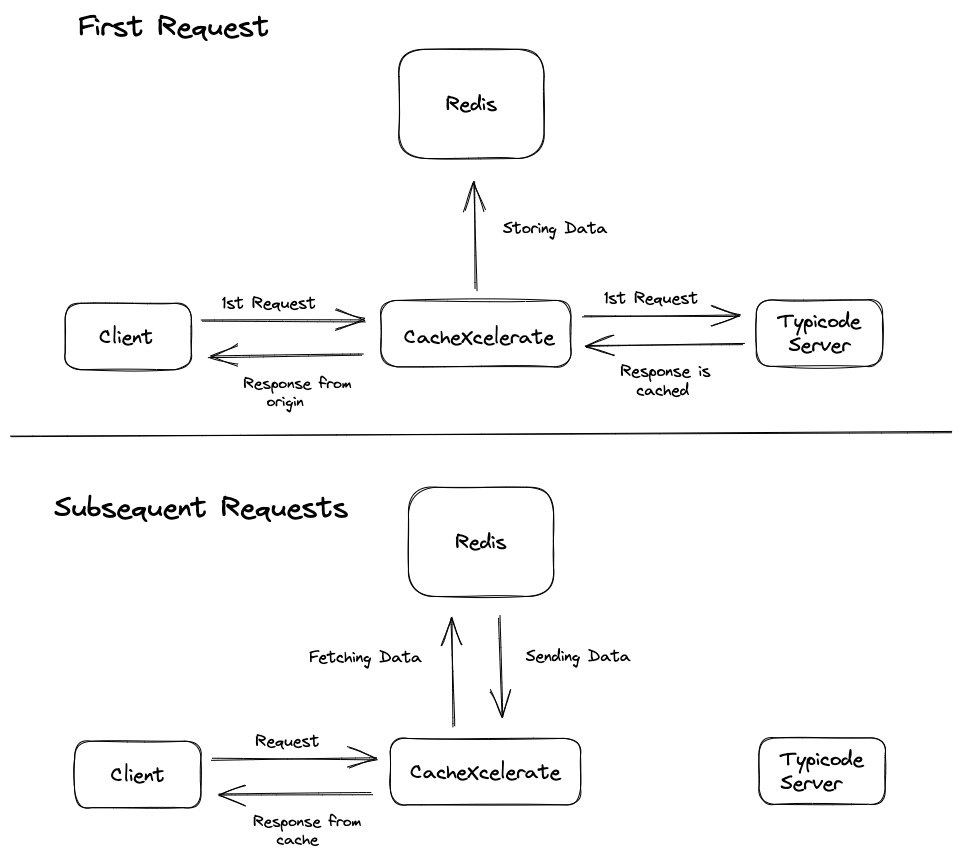

# CacheRocket: Caching API Server

This project is a simple API server built using Node.js that serves GET requests for data from two different endpoints: `/posts/:id` and `/todos/:id`. The data is fetched from https://jsonplaceholder.typicode.com and returned to the user.

In addition to serving data, the project also includes a `generic middleware` for caching API responses. This middleware caches data served over the API so that if the same API is called with the same parameters again, the response is served from the cache instead. The caching middleware is configurable, and can be enabled or disabled for a particular route.

<p align="center">
    
</p>

## Table of Contents

-   [CacheRocket: Caching API Server](#cacherocket-caching-api-server)
    -   [Table of Contents](#table-of-contents)
    -   [Technologies Used](#technologies-used)
    -   [Installation](#installation)
        -   [With Docker](#with-docker)
        -   [Without Docker](#without-docker)
        -   [ENV Variables](#env-variables)
    -   [Code Organization](#code-organization)
    -   [API Endpoints](#api-endpoints)
    -   [Unit Tests](#unit-tests)
    -   [License](#license)

## Technologies Used

-   [GoLang](https://golang.org/) - A programming language that makes it easy to build simple, reliable, and efficient software
-   [Gin](https://gin-gonic.com/) - A web framework written in Go (Golang)
-   [Redis](https://redis.io/) - An in-memory data structure store, used as a database, cache and message broker
-   [Docker](https://www.docker.com/) - A platform for developers and sysadmins to build, run, and share applications with containers
-   [Docker Compose](https://docs.docker.com/compose/) - A tool for defining and running multi-container Docker applications

## Installation

To install the project, follow these steps:

### With Docker

1. Clone the project repository from GitHub using `git clone https://github.com/anshg1214/CacheRocket`
2. Navigate to the project directory using `cd CacheRocket`
3. Run `cp .env.example .env` to copy the example environment file to a new file named `.env`.
4. Run `docker compose up --build` to build the Docker image and start the container.
5. The API server will be available at http://localhost:8080.

### Without Docker

**Note**: You need to have Redis installed on your machine to run the project without Docker.

1. Clone the project repository from GitHub using git clone
2. Navigate to the project directory using cd your-repo-name
3. Run `cp .env.example .env` to copy the example environment file to a new file named `.env`
4. Run `go mod download` to install the project dependencies
5. Run `go build` to build the project
6. Run `./CacheRocket` to start the server
7. The API server will be available at http://localhost:8080.

### ENV Variables

1. `REDIS_URL` - The URL of the Redis server. Defaults to `localhost:6379`
2. `CACHE_POSTS` - Whether to enable caching for the `/posts/:id` route. Defaults to `true`
3. `CACHE_TODOS` - Whether to enable caching for the `/todos/:id` route. Defaults to `true`

## Code Organization

The project is organized as follows:

-   `main.go` - The main entry point for the project. This file initializes the server and routes.
-   `config` - Contains the configuration files for the project
-   `controller` - Contains the controller functions for the routes
-   `middleware` - Contains the cache middleware functions for the project
-   `Dockerfile` - The Dockerfile for the project
-   `docker-compose.yml` - The docker-compose file for the project

## API Endpoints

The project exposes the following API endpoints:

-   `GET /posts/:id` - Fetches a post with the given ID from `https://jsonplaceholder.typicode.com/posts/:id`
-   `GET /todos/:id` - Fetches a todo with the given ID from `https://jsonplaceholder.typicode.com/todos/:id`

## Unit Tests

The project includes unit tests for the cache middleware.

To run the tests with Docker, run `docker compose run --rm app go test`.
To run the tests without Docker, run `go test`.

## Performance Tests

The script `scripts/testPerformance.sh` can be used to test the performance of the API server. The script makes 5000 requests to the API server and measures the time taken to serve the requests. The script also measures the time taken to serve the same requests from the cache.

Note: You need to install apache benchmark (`ab`) to run the script. On Ubuntu, you can install it using

```
sudo apt install apache2-utils
```

To run the script, run `./scripts/testPerformance.sh`.

Sample output:

```
$ ./scripts/testPerformance.sh

> This script will compare the response times of a website when using cache and when not using cache.

> First sending 5000 requests to the website without using cache.

> ......

> Average response time: 145.682 miliseconds
> Minimum response time: 31.761 miliseconds
> Maximum response time: 324.365 miliseconds


> Now sending 5000 requests to the website using cache.

> ......

> Average response time: 52.526 miliseconds
> Minimum response time: 11.822 miliseconds
> Maximum response time: 109.429 miliseconds

```

We can see that the average response time is reduced by 65% when using cache. The minimum response time is also reduced by 60%.

## License

This project is licensed under the [MIT License](https://opensource.org/licenses/MIT). See the LICENSE file for more details.
